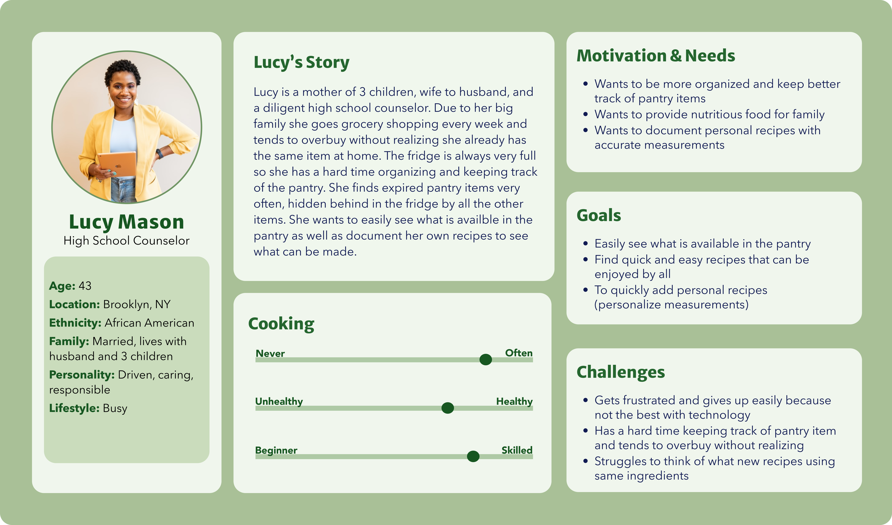

# Assignment 04: UX Storytelling
Mikayla Noh | DH110 | Fall 2022

## Purpose of UX Storytelling
> Although cooking and eating is part of our daily lives, everyone has their own unique ways of organizing the pantry, buying groceries, and tracking food waste. It is pertinent to think about these factors in different perspectives to further learn what can be done to make a product more usable. We all have different lifestyles so the purpose of UX storytelling in my project is to consider these differences and account for all possible pain points and ways to help different users with various lifestyles.

## Proposing Design Features
Based on user research from previous assignments, users frequently feel overwhelmed by the layout of the pantry in the pantry section of the app. Another issue is the lack of motivation for users to continue using Cooklist to track their pantry.
* **Pantry Layout:** Implement more minimal design and better categories for clear organization
* **Incentives:** Include other features that can motivate users to continue using the app such as allowing users to be aware to money and energy waste

## Persona & Empathy Map

### Persona 1 -- Lucy Mason: working mom

