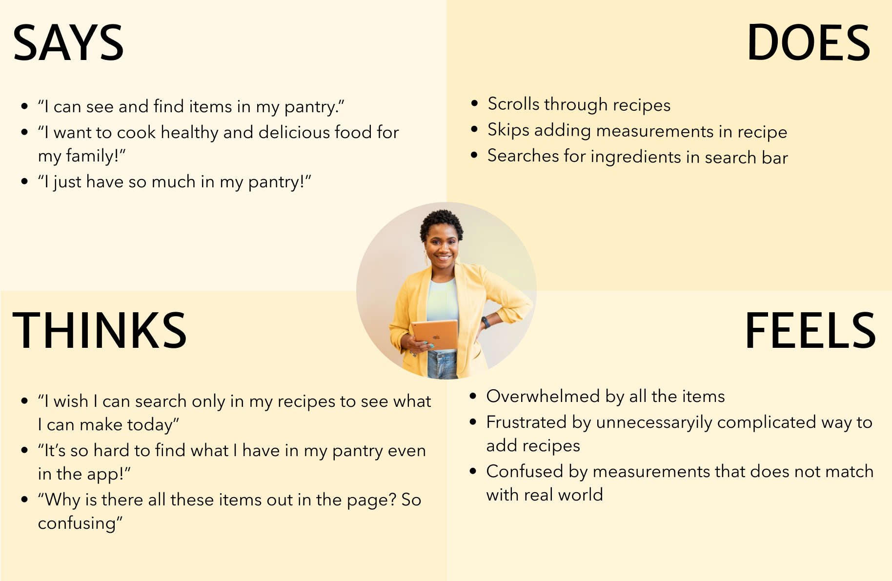
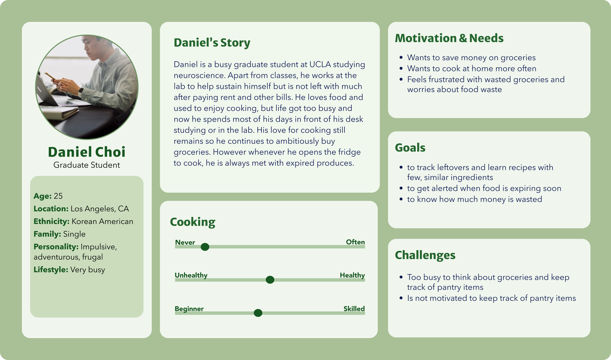
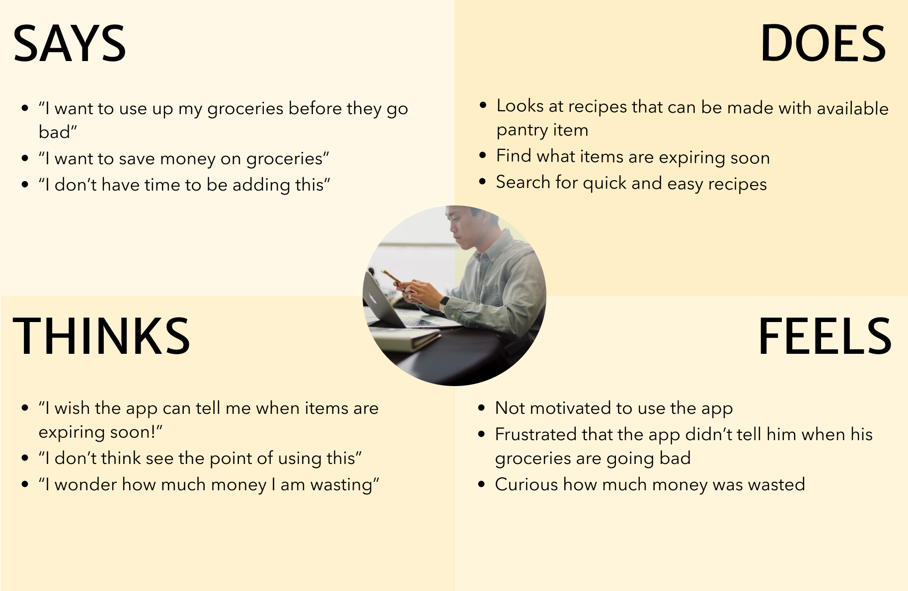
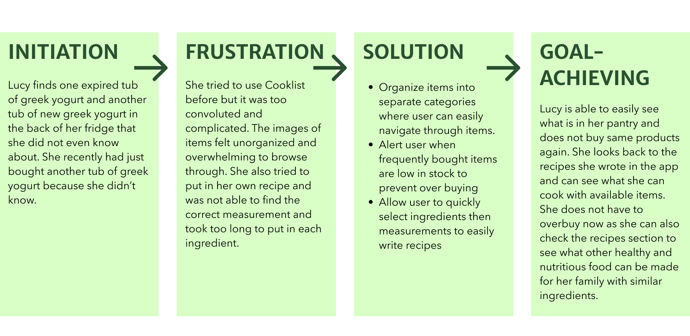
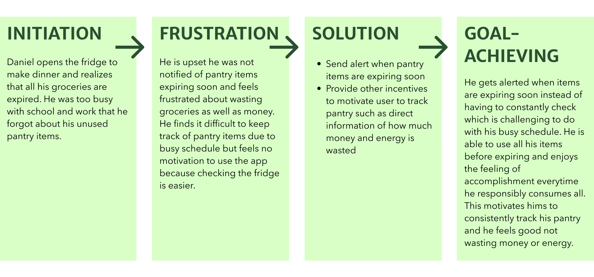

# Assignment 04: UX Storytelling
Mikayla Noh | DH110 | Fall 2022

## Purpose of UX Storytelling
> Although cooking and eating is part of our daily lives, everyone has their own unique ways of organizing the pantry, buying groceries, and tracking food waste. It is pertinent to think about these factors in different perspectives to further learn what can be done to make a product more usable. We all have different lifestyles so the purpose of UX storytelling in my project is to consider these differences and account for all possible pain points and ways to help different users with various lifestyles.

## Proposing Design Features
Based on user research from previous assignments, users frequently feel overwhelmed by the layout of the pantry in the pantry section of the app. Another issue is the lack of motivation for users to continue using Cooklist to track their pantry.
* **Pantry Layout:** Implement more minimal design and better categories for clear organization
* **Incentives:** Include other features that can motivate users to continue using the app such as allowing users to be aware to money and energy waste

## Persona & Empathy Map

### Persona 1 - Lucy Mason: working mom

#### Lucy's Empathy Map

### Persona 2 - Daniel Choi: UCLA graduate student

#### Daniel's Empathy Map

## Scenario & Journey Map

### 1. Lucy's Scenario & Journey Map

#### Why?
> fefe

#### How?
> fefe

### Lucy's Journey Map

### 2. Daniel's Scenario & Journey Map

#### Why?
> Daniel finally has some time and opens the fridge to make some dinner only to realize that all the produces have gone bad. He ends up wasting even more money buying groceries and ordering food. He wants to simplify his grocery list to minimize spending while still having the option to cook different recipes. He wishes that he had known his produces were going bad so that he could’ve used them earlier. 

#### How? 
> He goes on his phone and opens the Cooklist app. He sees the list of “expiring soon” pantry items that he was not aware of. He goes to his profile and clicks on “notification” to allow notification for “expiring soon”. Now he gets an alert when items are expiring and as soon as he opens the app, he sees the “expiring soon” category with respective items along with the dates. He clicks on “view all” at the top right corner to see the full list. He swipes right to the “waste” section to see the potential amount of money and energy wasted if he does not use the items soon. He is shocked and feels more motivated to track his pantry after seeing how much money and energy is being wasted due to food waste. He never realized the environmental harm it can cause and felt like his individual action of producing less food waste can slightly help to build a more sustainable future. He adds ingredients of one dish to his shopping list and presses the “chef” icon to see the potential

### :world_map: Daniel's Journey Map

