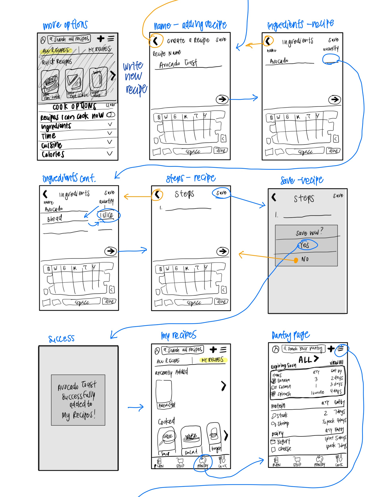
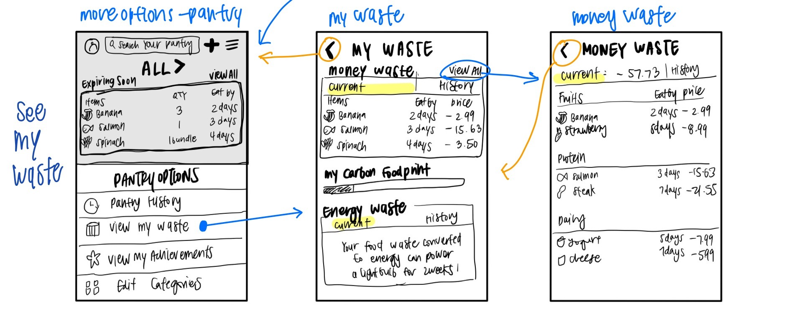

# Assignment 05: Low-Fidelity Prototype
Mikayla Noh | DH110 | Fall 2022

## Project Description
My current project focuses on encouraging responsible consumption by allowing users to easily track their pantry using the Cooklist app to reduce individual food waste. Food waste is very commonly produced by every individual yet easily avoidable through proper pantry tracking. In efforts of improving Cooklist for users to make it more usable and motivating, I will be creating a low-fidelity prototype first. The purpose of low-fidelity prototyping is to test how users will interact with an application in the early stages of design. I hope to learn from their feedbacks and interactions and revise accordingly to further improve the application’s usability. 

### **User Research**
Current user-research indicates that the app is unnecessarily complex, making it more difficult to use than it needs to be. Users during usability testing expressed feelings of overwhelmingness when navigating the pantry section due to its layout showing images of all pantry items under broad categories. Users also expressed feelings of frustration when writing personal recipes due to its lengty process. I found that although pantry tracking may seem like a simple task, it can be tedious for users and requires more motivation to consistently do so.

### **Personas and Scenarios**
Some characteristics of target users include busy students, working adults, big families, busy parents with children, and anyone who frequently grocery shops and cooks. I created personas and scenarios based on theses characteristics of users who live busy lives:

- Graduate student that works at the lab part time who gets too busy with life and frequently forgets about pantry items at home
- Working mom with husband and 3 children who overbuys and forgets about items that are available in pantry

You can learn more about them [here](https://github.com/mkylahyun/DH110/tree/main/assignment004)!
### **Features**
Keeping the personas and usage scenario in mind, I came up with three features they could find useful in solving their problems:
- Layout that shows clear indication of expiration dates and organized categories
- Quick recipe feature where users can quickly add personal recipes
- Waste indicator that shows how much money user is wasting as well as the environmental harm user is causing from food waste

## Tasks
1. Find freezer section and see what items are expiring soon
2. Quick add personal recipe
3. See how much money and food is being wasted

## Wireframes and Wireflows

## Low-Fidelity Prototype Testing

