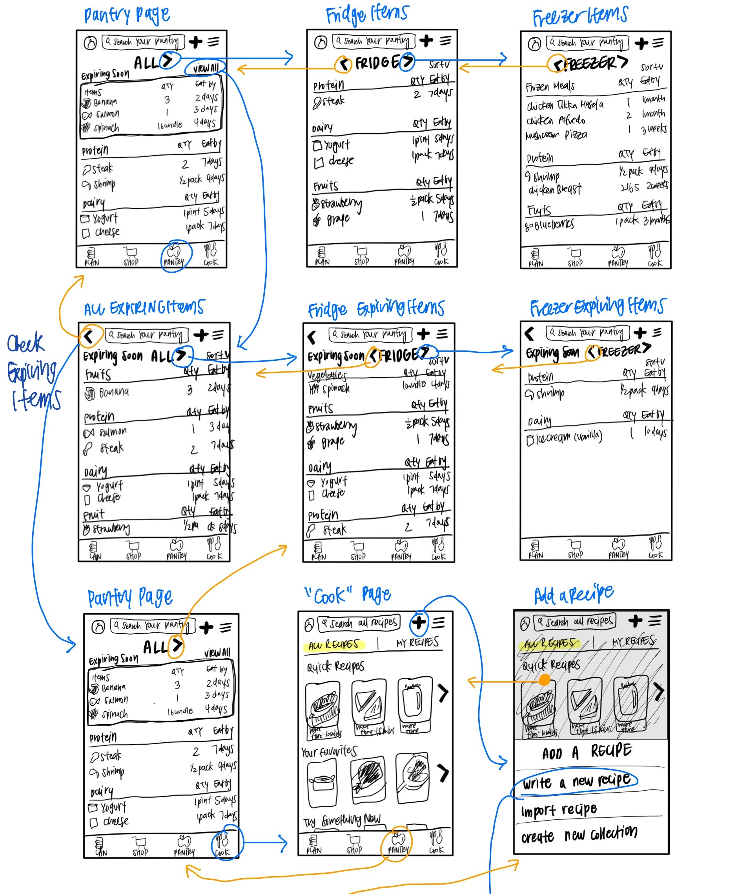
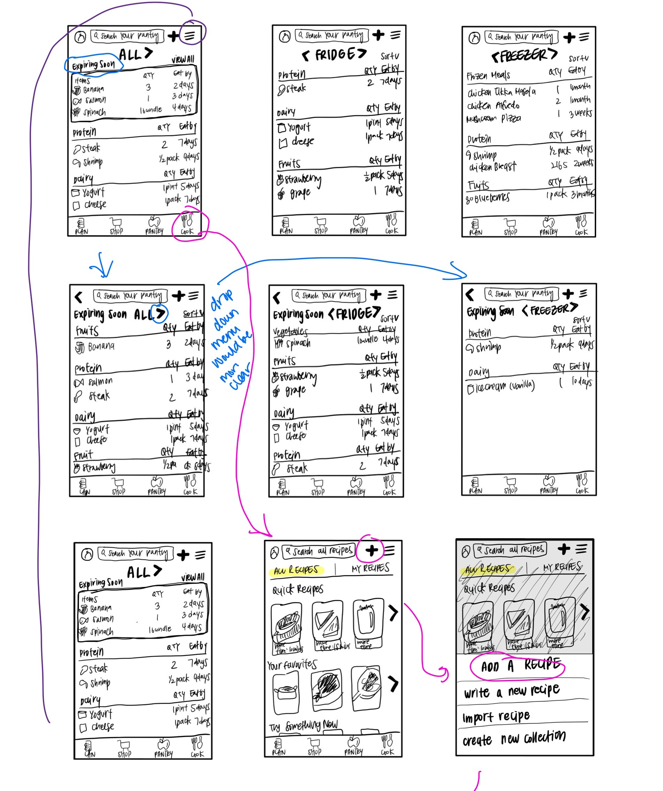
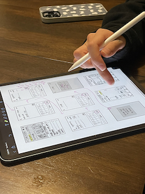

# Assignment 05: Low-Fidelity Prototype
Mikayla Noh | DH110 | Fall 2022

## Project Description
My current project focuses on encouraging responsible consumption by allowing users to easily track their pantry using the Cooklist app to reduce individual food waste. Food waste is very commonly produced by every individual yet easily avoidable through proper pantry tracking. In efforts of improving Cooklist for users to make it more usable and motivating, I will be creating a low-fidelity prototype first. The purpose of low-fidelity prototyping is to test how users will interact with an application in the early stages of design. I hope to learn from their feedbacks and interactions and revise accordingly to further improve the application’s usability. 

### **User Research**
Current user-research indicates that the app is unnecessarily complex, making it more difficult to use than it needs to be. Users during usability testing expressed feelings of overwhelmingness when navigating the pantry section due to its layout showing images of all pantry items under broad categories. Users also expressed feelings of frustration when writing personal recipes due to its lengty process. I found that although pantry tracking may seem like a simple task, it can be tedious for users and requires more motivation to consistently do so.

### **Personas and Scenarios**
Some characteristics of target users include busy students, working adults, big families, busy parents with children, and anyone who frequently grocery shops and cooks. I created personas and scenarios based on theses characteristics of users who live busy lives:

- Graduate student that works at the lab part time who gets too busy with life and frequently forgets about pantry items at home
- Working mom with husband and 3 children who overbuys and forgets about items that are available in pantry

You can learn more about them [here](https://github.com/mkylahyun/DH110/tree/main/assignment004)!
### **Features**
Keeping the personas and usage scenario in mind, I came up with three features they could find useful in solving their problems:
- Layout that shows clear indication of expiration dates and organized categories
- Quick recipe feature where users can quickly add personal recipes
- Waste indicator that shows how much money user is wasting as well as the environmental harm user is causing from food waste

## Tasks
1. Find freezer section and see what items are expiring soon
2. Quick add personal recipe
3. See how much money and food is being wasted

## Wireframes and Wireflows

## Low-Fidelity Prototype Testing
Task 1 is done in blue, Task 2 in pink, and Task 3 in purple. 

#### Notes:
**Task 1** 
- User did not know how to get from "All" to "Freezer" as she didn't know the arrow was supposed to be used to move to different sections
- User did not use the "View all" to go to the full screen but clicked on the "Expiring Soon" to see full list 

**Task 2**
- User was not sure if writing recipe was in "Plan" or "Cook"
- User was not sure what "Plan" was
- User clicked on the title "Add a recipe" instead of "Write a new recipe" to create new recipe
- User was confused on how to get to next step; to click "done" or arrow

**Task 3**
- User succesfully used hamburger option icon in pantry section to see personal money and energy waste

## Reflection
It was interesting to finally design and create a low-fidelity prototype and I was able to realize how important all the previous steps and research is to get to this stage. Creating a low-fidelity prototype was more complicated than I had assumed, especially when I had to design with so many other accomodations in mind. I felt like there were so many options I could include to make it more usable but also could be more complicated for the users. Overall my wireflow testing process went smoothly and the participant successfullly completed all the tasks. She did face some confusions and struggled to get to the next step but she was able to eventually figure it out. 

Task 1 went very differently from my expectation as I had thought it would be the easiest one. I learned that the arrow to move to a different section may not be as clear as I had intended. The user was confused on how to get to the "Freezer" section and thought that the arrow would take her to a completely different page. I would use a drop down menu instead when revising to make it clear that the change is happening in the same page instead of a "shift". I also thought that the "View all" would be used to see more but the user cliked on the title, "Expiring soon" instead to see the full list. Maybe the "View all" is not necessary and I can make the title look more like a button next time to make it more intuitive. 

Task 2 also had a similar problem where the user clicked on the title "Add a recipe" instead of the choices to create a new recipe. I think adding an icon next to the option titles would make it more obvious that those are the choices that need to be clicked. The user also struggled a bit when creating a new recipe since she was not sure whether "done" or the arrow would take her to the next step. I would revise the arrow sign to an "enter" sign to make the flow more smooth and reduce confusions on whether it is to go to the next step or to the next line for adding ingredients. 

The user surprisingly did not have much trouble in Task 3 and immediately went to the hamburger tab of the pantry section to see the options for viewing "My Waste". She was able to easily find where to view money and energy waste after selecting the option as well. 

Based on the feedback I got from the prototype testing, I would focus on making the flow for the recipe more clear and adjust the pantry section layout to drop down menus instead of horizontal carousels. I realized that the arrow I used for switching sections in the pantry section is the same arrow as the back icon, which led to my participant thinking that it will take her to a completely different page instead of switching sections within the page. By creating this overlap with different functions, I confused the user and she was not easily able to figure out how to find the "Freezer" section.
