# Assignment 06: Interface Design
Mikayla Noh | DH110 | Fall 2022

## Project Purpose & Process Description
The purpose of my project is to redesign Cooklist, a mobile app that helps users keep track of their pantry, to make the layout more usable so more users can easily view what they have in their pantry through the ease of their phones. Through this lifestyle change, users can consume more responsibly and reduce individual food waste. Although pantry tracking seems like an easy task, users often feel overwhelmed by the amount of information that is shown in the main screen. By clearly showing what items are expiring soon, users are able to quickly grasp this information. Visibly showing categories can also help with the feeling of overwhelmingness as they can easily navigate the app and accomplish their task. 

Below is my example lo-fi wireframe that I have used as reference when creating the design in Figma. 
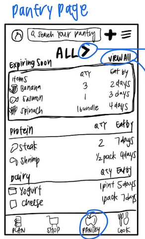 

Full screen design tests are viewable [here](https://www.figma.com/file/eYioH1WNqZgr8LfyDJ2ejG/DH110_Assignment006?node-id=0%3A1) in Figma.

## Screen Design
### **Layouts**
### Frame Layouts:
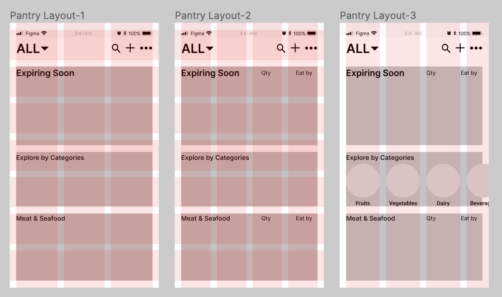

### Text Layouts:
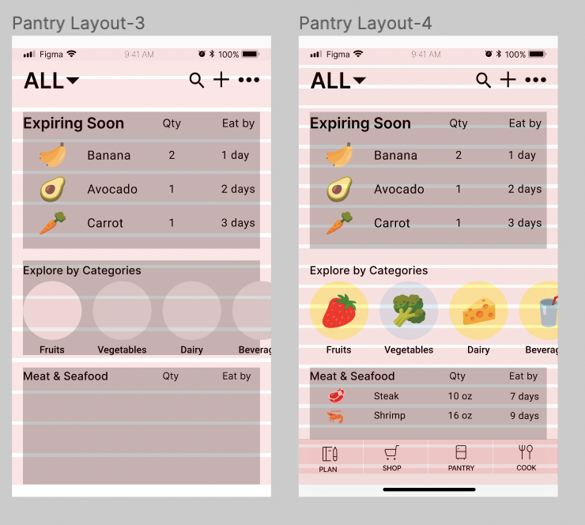

### Typography Variations:
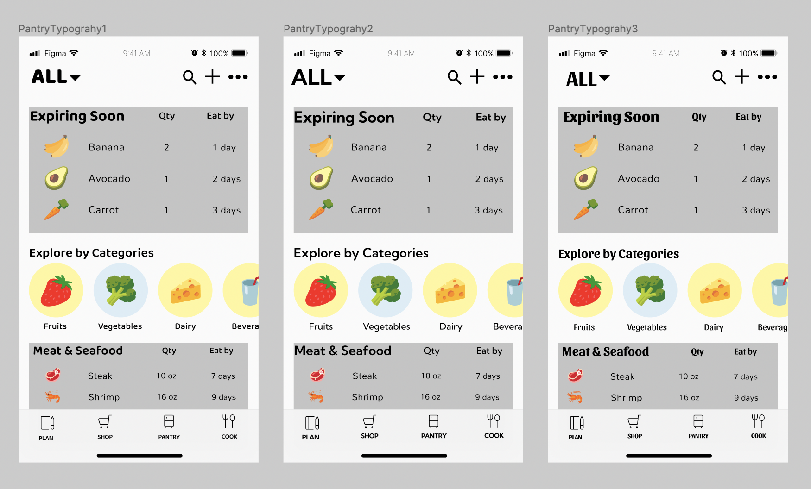

### Shape Variations:
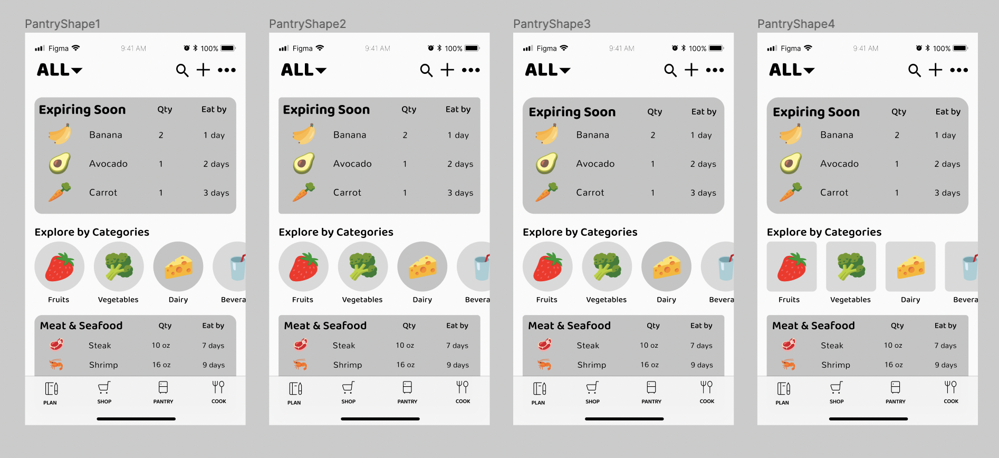

### Color Variations:
#### Light Color Variations:
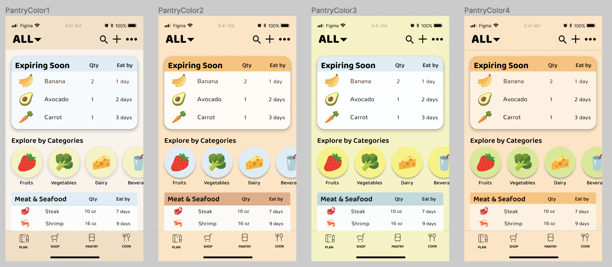

#### Light and Dark Variations:
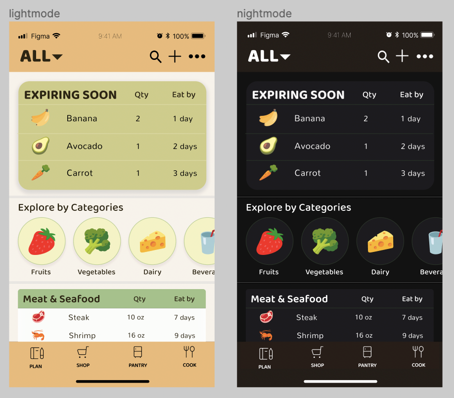

## Impression Test
Please find the recording of the impression test here.
### Summary of Findings
The participant had a good general idea of what the app was for after the impression test as he assumed the app was for tracking food. He was able to remember the food icons, general context of the text, and colors. He specially noted how he remembers the colors being very pastel and described the feeling as "cute". However, even after a quick glance, he noted how it felt a bit cluttered and how some users might feel overwhelmed by the amount of information that is laid out. 

## Accessibility (Color-Contrast) Check
I used the Spark plugin in Figma to check the color contrast for the accessibility WCAG2.0 AA level. My design passed all the checks. 
### Light-mode Check
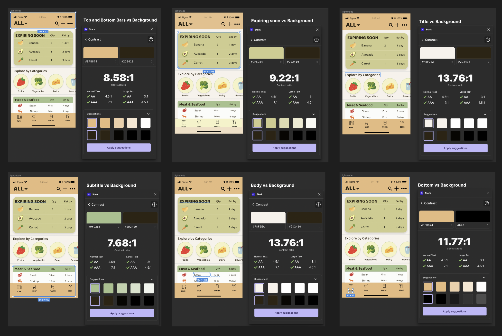

### Dark-mode Check
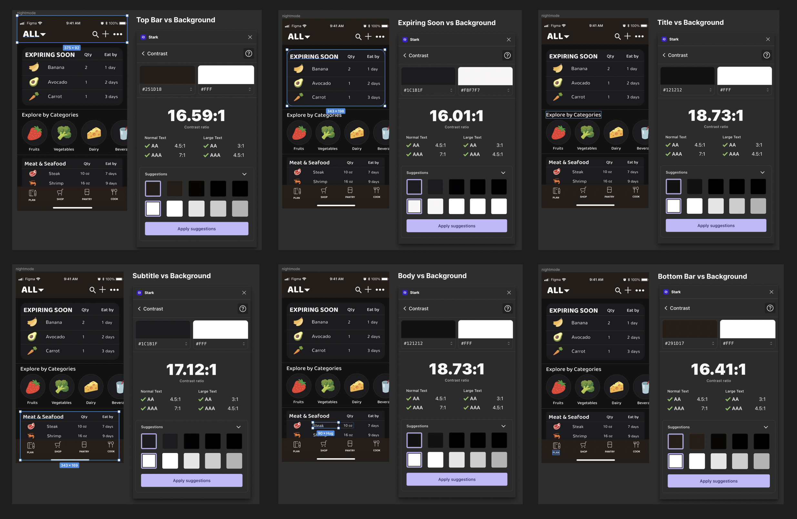

## Design System
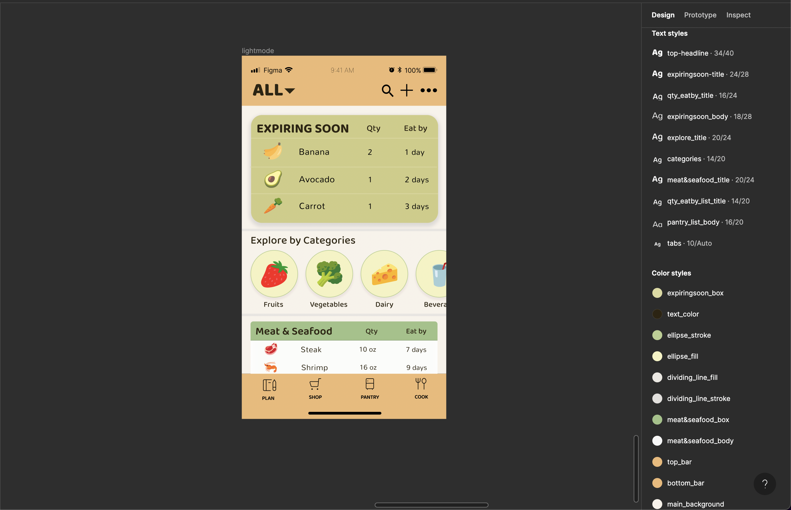
This is my graphic design system saved in Figma.

### Colors
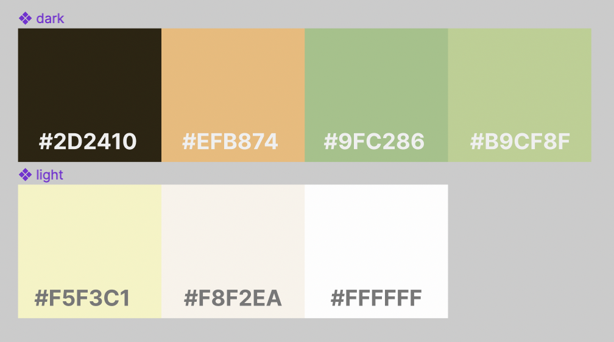
I wanted to use warmer colors with accents to give the pantry layout a more fun look. Food is often marketed with warmer tones so I decided to choose orange, and chose green for a natural, sustainable look. To create a pop of color, I used a brighter yellow for the categories so that users can easily see and use the feature. I made the "Expiring Soon" block a toned-down color to represent the groceries going bad, and to inform users the urgency. For rest of the list, I only highlighted the category's name and left the body white so that it is easier for users to read.  

### Layout
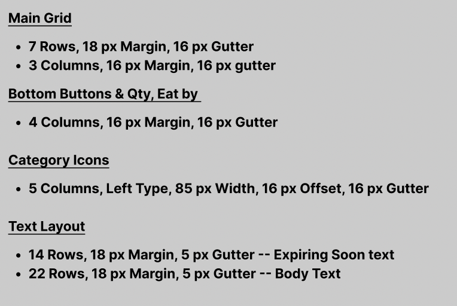
I decided to use 7 rows and 3 columns for my main grid to divide the top bar, "Expiring Soon" box, categories, "Meat & Seafood" box, and bottom bar and to seperate the main title and smaller text in the title. I then used another 4 column layout to align my bottom tab icons as well as the "Qty" and "Eat by" texts, which I aligned in the middle of the columns. For the category icons, I wanted to offset on the left to create a horizontal carousel so I used 5 columns with 85 px width and 16 px offset. I used 16 px gutter as well to create enough space but also show their relatedness. Since my "Expiring Soon" box had larger text, I created two text layouts -- one with 14 rows for "Expiring Soon" and 22 rows for "Meat & Seafood" since it has smaller text. 

### Typeface Family & Size
All text is in **#2D2410** color. 

* For **header**, **titles**, **tabs** I used a typeface called **"Baloo 2"**
  * Top Headline: 34px, ExtraBold
  * Expiring Soon Title: 24px, Bold
  * Expiring Soon Qty & Eat by: 16px, Medium
  * Categories Title: 20px, Medium
  * Categories Subtitle: 14px, Medium
  * Meat & Seafood Title: 20px, SemiBold
  * Subtitle: 14px, Medium 
  * Tabs: 10px, SemiBold
* For **body** texts, I used a typeface called "Mallana"
  * Expiring Soon Body: 18px
  * Body: 16px

