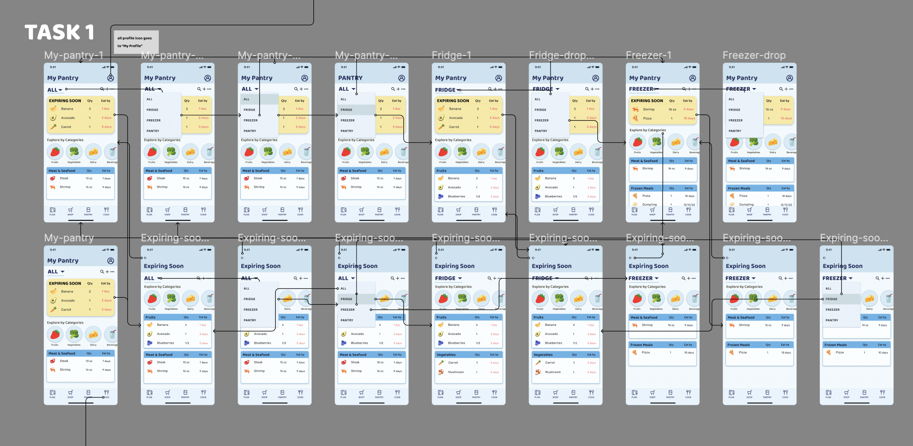
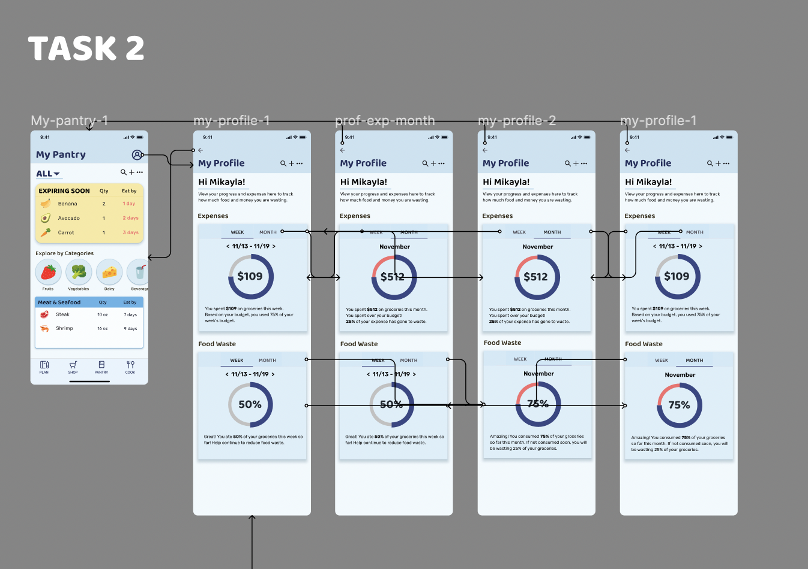
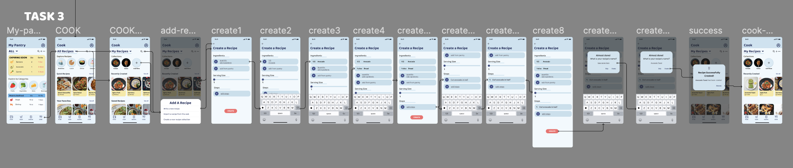
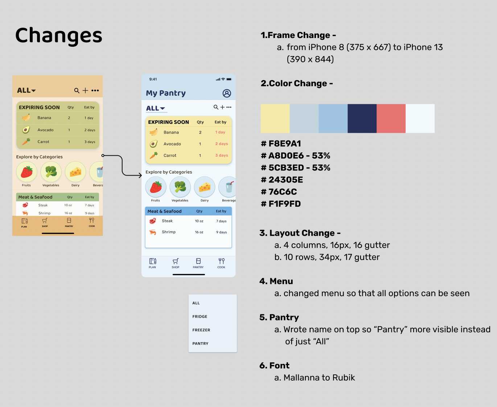

# Assignment 07: High Fidelity Prototype
Mikayla Noh | DH110 | Fall 2022

## Project Purpose & Process Description
The purpose of this project is to redesign Cooklist, an app that allows users to track their pantry in hopes of encouraging individual action towards reducing food waste. This interactive high-fidelity prototype aims to create a more user-friendly interface for the pantry layout to make the items that are expiring soon easily visible. It also adds a feature where users can track their expenses and food waste to give users more motivation to use the app as well as continue to consume responsibly. 

I used Figma to create this prototype and changed the interface design and flow from the previous lofi-prototype and design assignments. I kept the overall design but changed the colors to give it a more clean look. For the recipe and expense flows, I changed it to make it more simple per my previous impression test. I created less screens/clicks and incorporated a more visible interface design. 

The link to my interactive prototype can be found [here](https://www.figma.com/proto/leVkul1V7MAmqo8Sa6U1N6/DH110-Assignment07-Wireframes-with-GUI?node-id=133%3A26794&scaling=scale-down&page-id=0%3A1&starting-point-node-id=133%3A26794&show-proto-sidebar=1). 

## Tasks
This interactive prototype supports 2 tasks
1. Finding items in the pantry section and seeing what items are expiring soon
2. Tracking expenses and food waste to see personal waste

## Wireflow with Graphic Design
The complete wireflow of the 2 tasks and an additional task that is not included in the interactive prototype can be seen below.
The wireflow can also be seen [here](https://www.figma.com/file/leVkul1V7MAmqo8Sa6U1N6/DH110-Assignment07-Wireframes-with-GUI?node-id=0%3A1&t=wYRn3lerzJvXMOsX-1) in Figma.

### Task 1: 

### Task 2:

### Task 3:

## Updates

Based on the feedback I got while working on this assignment and the previous impression test, I changed the design of my interface. The biggest concern was how I can organize the pantry layout so that it can look properly categorized and not cluttered while working with many items, considering that the app is to track user's pantry- which usually have many items. I first changed my frame size from iPhone 8 to iPhone 13 to give the overall layout more space. I tried many iterations of different colors, which can be found [here](https://www.figma.com/file/5OEGBNRDuOOJ74QofOlv5U/Design-Changes), to see what color can spark excitement when using the app. The previous color choices looked too dark and not clean enough so I opted for using more cool tones, blue, with warm accents through the color yellow. I also changed the body's font style from "Mallanna" to "Rubik" following the clean look and to give it more structure.

### Flow

I changed the expenses and money tracking page to be found in "Profile" instead of in the "Pantry" options as it is a more personal feature than it is related to the Pantry. The layout of the page is also more visual as I used graphs to give users an easy summary instead of another list. I changed the wording to be more motivational as well to encourage users to continue reducing food waste rather than discourgae them from using the app and not track their pantry. I added a title for the Pantry section to give more clarity on what tab users are on instead of just having "All". I also bolded the bottom tab and made the icon bigger as it seemed too small and thin in the previous iteration.  

https://www.figma.com/proto/leVkul1V7MAmqo8Sa6U1N6/DH110-Assignment07-Wireframes-with-GUI?node-id=133%3A26794&scaling=scale-down&page-id=0%3A1&starting-point-node-id=133%3A26794&show-proto-sidebar=1
